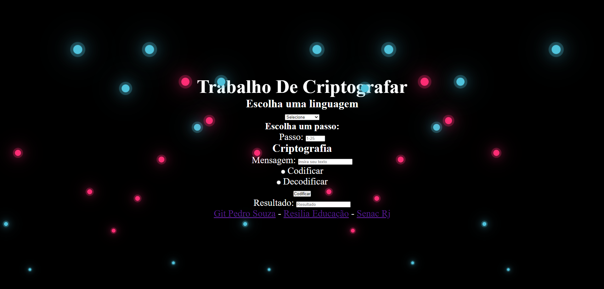

# Projeto Individual, Módulo 2, Codificador e Decodificador 🧑🏾‍💻 
<h2>Nesta criptografia, utilizei somente as linguagens: 

&nbsp;
&nbsp;
&nbsp;

<h2> Fiz este Projeto na sala de aula do curso da RESILIA em conjunto com o SENAC, PROGRAMADORES CARIOCAS, foi um trabalho individual, que após entregue, venho frequentemente aperfeiçoando o mesmo, visando meu desenvolvimento profissional </h2>
<h2> Espero que gostem! :) </h2>
